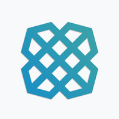

NPM Module for payment providers
===========

Building an open source Node module to provide access to some of the following APIs:

[Plaid](https://plaid.com/docs/)

[Coinbase](https://developers.coinbase.com/)

[Dwolla](https://developers.dwolla.com/)

[Stripe](https://stripe.com/docs)

[SynapsePay](http://synapsepay.com/)

.. More to come

Installation
----------

Install via [npm](http://npmjs.org/)

    npm install payment-sync --save

Initialize PaymentSync with your public and private keys for each service. Pass variable true : false for isSandbox.

    var paymentSync = require('payment-sync')(credentialsObject, isSandbox);

Endpoints
----------

- All callbacks are passed an error and response: `callback(err, res)`.

- Supports camelCase and underscore naming conventions (Textmaster uses the underscore convention).

- Please refer to the API docs for each provider:

[Plaid API Docs](https://plaid.com/docs/) for endpoint details.

[Dwolla API Docs](https://docsv2.dwolla.com/) for endpoint details.

[Coinbase API Docs](https://developers.coinbase.com/api/v2) for endpoint details.

[Stripe API Docs](https://stripe.com/docs/api) for endpoint details

[Synapse Pay Docs](http://docs.synapsepay.com/) for endpoint details

**paymentSync.plaid**

    paymentSync.plaid.account.create(data, callback);

    {
      clint_id: clientId,
      secret: secret,
      username: 'johnnywu',
      password: 'test123',
      type: 'bofa',
      options: {
        webhook: 'https://test.com/test/webhook',
        login_only: true
      }
    }

    paymentSync.plaid.account.mfa(data, callback);

    {
      client_id: clientId,
      secret: secret,
      mfa: '1992 Rolls',
      access_token: accessToken
    }

    paymentSync.plaid.account.info(data, callback);

    {
      client_id: clientId,
      secret: secret,
      access_token: access_token
    }

    paymentSync.plaid.account.balance(data, callback);

    {
      client_id: clientId,
      secret: secret,
      access_token: access_token
    }

    paymentSync.plaid.account.update(data, callback);

    {
      client_id: clientId,
      secret: secret,
      username: username,
      password: password,
      access_token: access_token
    }

    paymentSync.plaid.account.delete(data, callback);

    {
      client_id: clientId,
      secret: secret,
      access_token: access_token
    }

    paymentSync.plaid.institution.list(callback);

    {

    }

    paymentSync.plaid.institution.info(data, callback);

    {
      id: institutionId
    }

    paymentSync.plaid.account.exchangeToken(data, callback);

    {
      access_token: access_token,
      client_id: clientId
    }

**paymentSync.dwolla**

    paymentSync.dwolla.account.create(data, callback);

    {
      firstName: 'Johnny',
      lastName: 'Wu',
      email: 'johnny@wu.com',
      type: 'personal', // personal || business
      address1: '123 Test Address',
      city: 'San Francisco',
      state: 'CA',
      postalCode: 12345,
      dateOfBirth: 123456,
      ssn: 1234,
      phone: 1234567890
    }

    paymentSync.dwolla.account.info(data, callback);

    {
      id: accountId
    }

    paymentSync.dwolla.account.auth(data, callback);

    {
      grant_type: 'grant_type',
      scope: 'balance|accountinfofull|send|request|transactions|contacts|funding|manageaccount|scheduled|managecustomers',
    }

    paymentSync.dwolla.account.refreshAuth(data, callback);

    {
      client_id: clientId,
      client_secret: clientSecret,
      refresh_token: refreshToken,
      grant_type: grantType // 'client_credentials' || 'referesh_token'
    }

    paymentSync.dwolla.funding.create(data, callback);

    {
      id: fundingSourceId,
      routingNumber: 123412341234,
      accountNumber: 000012340001234,
      type: 'checkings', // checking || savings
      name: 'B of A checking'
    }

    paymentSync.dwolla.funding.info(data, callback);

    {
      id: fundingSourceId
    }

    paymentSync.dwolla.funding.list(data, callback);

    {
      id: fundingListId
    }

    paymentSync.dwolla.funding.verify(data, callback);

    {
      id: customerId
    }

    paymentSync.dwolla.transfer.create(data, callback);

    {
      \_links: 'https://api.dwolla.com/funding-sources/fundingSourceId',
      amount: {
        value: 100,
        currency: 'USD'
      },
      metadata: {
        date: '01-01-2015',

      }
    }

    paymentSync.dwolla.transfer.get(data, callback);

    {
      id: transferId
    }

    paymentSync.dwolla.transfer.customer(data, callback);

    {
      id: customerId
    }

    paymentSync.dwolla.transfer.account(data, callback);

    {
      id: accountId
    }

    paymentSync.dwolla.document.create(data, callback);

    {
      documentType: type, // 'passport' || 'driversLicense' || 'idCard' || 'other'
      file: fileContents
    }

    paymentSync.dwolla.document.list(data, callback);

    {
      id: customerId
    }

    paymentSync.dwolla.document.info(data, callback);

    {
      id: customerId,
      documentId: documentId
    }

    **paymentSync.coinbase**

    paymentSync.coinbase.account.create(data, callback);

    paymentSync.coinbase.account.info(data, callback);

    paymentSync.coinbase.transaction.create(data, callback);

    paymentSync.coinbase.transaction.info(data, callback);

**paymentSync.stripe**

    paymentSync.stripe.account.create(data, callback);

    {
      description: 'Customer account for johnny@wu.com',
      source: "tok_17KCtL2eZvKYlo2CYK3Rybdr", // obtained with Stripe.js
      account_balance: 0,
      email: 'johnny@wu.com',
      metadata: {
        'test': 'test',
        'address': '123 Test'
      }
    }

    paymentSync.stripe.account.info(data, callback);

    {
      id: customerId
    }

    paymentSync.stripe.transaction.create(data, callback);

    {
      amount: 400,
      currency: "usd",
      source: "tok_17KCtL2eZvKYlo2CYK3Rybdr", // obtained with Stripe.js
      description: "Charge for johnny@wu.com"  
    }

    paymentSync.stripe.transaction.info(data, callback);

    {
      id: chargeId
    }

**paymentSync.synapse**

  paymentSync.synapse.account.create(data, callback);

  {
    logins: [{
       "email": "johnny@wu.com",
       "password": password,
       "read_only": false
     }],
     phone_numbers: ["123.456.7890"],
     legal_names: ["Johnny Wu"],
     extra: {
       note: "Interesting user",
       supplier_id: "122eddfgbeafrfvbbb",
       is_business: false
     }
  }

  paymentSync.synapse.account.info(data, callback);

  {
    id: userId
  }

  paymentSync.synapse.account.update(data, callback);

  {
    id: userId,
    update: {
      login: {
        email: "test2@email.com",
        password: "test1234",
        read_only: true
        },
      remove_login:{
        email:"test2@email.com"
      },
      phone_number:"9019411111",
      remove_phone_number:"9019411111",
      legal_name:"Some new name"
    }
  }

  paymentSync.synapse.account.documents(data, callback);

  {
    id: userId,
    doc: {
      birth_day:4,
      birth_month:2,
      birth_year:1940,
      name_first:"John",
      name_last:"doe",
      address_street1:"1 Infinate Loop",
      address_postal_code:"95014",
      address_country_code:"US",
      document_value:"3333",
      document_type:"SSN"
    }
  }

  paymentSync.synapse.transaction.create(data, callback);

  {
    amount: 400,
    currency: "usd",
    source: "tok_17KCtL2eZvKYlo2CYK3Rybdr", // obtained with Stripe.js
    description: "Charge for johnny@wu.com"  
  }

  paymentSync.synapse.transaction.info(data, callback);

  {
    id: chargeId
  }

Contribute
----------

Forks and pull requests welcome!

TODO
----------
* Add tests

Author
----------

Jonathan Wu. Email me if you have any questions: [jonathan.x.wu@gmail.com](mailto:jonathan.x.wu@gmail.com).
